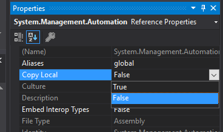

# ![logo][] PowerShell Standard

## Supports PowerShell Core and Windows PowerShell

PowerShell Core is a cross-platform (Windows, Linux, and macOS) automation and configuration tool/framework that works well with your existing tools and is optimized for dealing with structured data (e.g. JSON, CSV, XML, etc.), REST APIs, and object models.
It includes a command-line shell, an associated scripting language and a framework for processing cmdlets.

Windows PowerShell is a Windows command-line shell designed especially for system administrators.
Windows PowerShell includes an interactive prompt and a scripting environment that can be used independently or in combination.

PowerShell Standard is a reference assembly that has been created to assist developers create modules and PowerShell hosts which will run on PowerShell.
The reference assembly contains no actual implementation but rather will allow you to use only APIs that exist across different versions of PowerShell. This means that you still need to run within a PowerShell runtime.

> NOTE: You should not use PowerShell Standard for standalone applications that leverage PowerShell.
For that, you should use the [PowerShell SDK](https://www.nuget.org/packages/Microsoft.PowerShell.SDK).
PowerShell Standard's main scenario is for running within a PowerShell session.

## PowerShell Standard Libraries

Two PowerShell Standard `.nupkg` versions are available:

- PowerShell Standard.Library Version 3
  - This allows you to create PowerShell modules and PowerShell hosts which will run on PowerShell Version 3 and later including PowerShellCore

- PowerShell Standard.Library Version 5.1
  - This allows you to create PowerShell modules and PowerShell hosts which will run on PowerShell Version 5.1 and later including PowerShellCore

Both are available on [NuGet.org](https://www.nuget.org/packages/PowerShellStandard.Library)

[logo]: https://raw.githubusercontent.com/PowerShell/PowerShell/master/assets/Powershell_black_64.png

### Building PowerShell Standard Libraries

The script `build.ps1` is the tool to build, package, and test the PowerShell Standard Libraries.
In to build the PowerShell Standard Libraries simply type:

```powershell
./build.ps1
```

### Running tests

There are some very simple tests which test the validity of the PowerShell Standard Libraries.
These tests may be found in the test directory associated with the version of the PowerShell Standard Library
| Version | Location |
| 3 | `test/3` |
| 5 | `test/5` |

to run the tests, simply type:

```powershell
./build.ps1 -test
```

### Creating NuGet Packages

In order to create NuGet packages, simply type:

```powershell
./build.ps1 -Pack
```

This will create 2 NuGet packages; 1 for each version of the PowerShell Standard Library in the root of the repository.
These can then be uploaded to https://nuget.org/ if desired.

### Removing Build Artifacts

To remove all build artifacts (except for the .nuget files in the root of the repository), type the following:

```powershell
./build.ps1 -Clean
```

## How to use the PowerShell Standard Library

### Via Visual Studio

Using the PowerShell Standard Library within Visual Studio is as simple as installing the package into your solution and building the project

Create a project, and in the Package Manager Console (Tools -> Nuget Package Manager -> Package Manager Console) type:

```powershell
install-package -id PowerShellStandard.Library
```

This will add `System.Management.Automation` to your project references.
After this, you must set `Copy Local` to False in the Reference Properties pane.



This will keep the PowerShell Standard Library from being copied into your release/publish directories.
This is because the PowerShell Standard Library is a _reference_ assembly and doesn't actually contain any implementations and should never be distributed with your module.
You may now create and build your module in the usual way.

Once your module is built, you can see the portability of your module very easily, if you have both Windows PowerShell and PowerShell core on your system.
The following demonstrates the portability of using PowerShell Standard.

The following shows the same assembly being used by both Windows PowerShell, PowerShell Core, and via Docker; PowerShell Core on Linux.

```powershell
PS> powershell
Windows PowerShell
Copyright (C) Microsoft Corporation. All rights reserved.

Loading personal and system profiles took 714ms.
PS> gci

    Directory: C:\users\jimtru\documents\visual studio 2017\Projects\ClassLibrary2\ClassLibrary2\bin\Debug

Mode                LastWriteTime         Length Name
----                -------------         ------ ----
-a----         3/7/2019  10:54 AM           4608 ClassLibrary2.dll
-a----         3/7/2019  10:54 AM          15872 ClassLibrary2.pdb

PS> import-module .\ClassLibrary2.dll
PS> "joe","jane" | Invoke-Demo
Hello 'joe'
Hello 'jane'
PS> exit

PS> pwsh-preview
PowerShell 6.1.0-rc.1
Copyright (c) Microsoft Corporation. All rights reserved.

https://aka.ms/pscore6-docs
Type 'help' to get help.

PS> import-module .\ClassLibrary2.dll
PS> "joe","jane" | Invoke-Demo
Hello 'joe'
Hello 'jane'
PS> exit

PS> $m = "C:\Users\jimtru\DOCUME~1\VIBB41~1\Projects\CLASSL~2\CLASSL~1\bin\Debug"
PS> docker run --rm -it -v "${m}:/module" mcr.microsoft.com/powershell:preview
PowerShell 6.2.0-rc.1
Copyright (c) Microsoft Corporation. All rights reserved.

https://aka.ms/pscore6-docs
Type 'help' to get help.

PS /> hostname
add7d6ed4818

PS /> select-string pretty /etc/os-release
etc/os-release:5:PRETTY_NAME="Ubuntu 18.04.2 LTS"

PS /> gci /module
    Directory: /module
Mode                LastWriteTime         Length Name
----                -------------         ------ ----
------            3/7/19  6:54 PM           4608 ClassLibrary2.dll
------            3/7/19  6:54 PM          15872 ClassLibrary2.pdbPS /> import-module /module/ClassLibrary2.dll

PS /> Import-Module /module/ClassLibrary2.dll
PS /> "joe","jane" | Invoke-Demo
Hello 'joe'
Hello 'jane'
```

And that's how you can build a single module used by Windows PowerShell, PowerShell Core on Windows and Linux!
